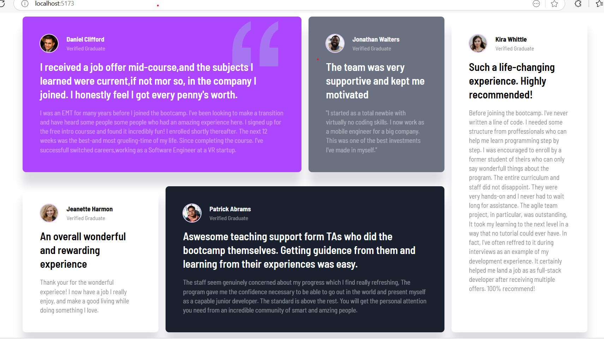

# Frontend Mentor - Testimonials grid section solution

This is a solution to the [Testimonials grid section challenge on Frontend Mentor](https://www.frontendmentor.io/challenges/testimonials-grid-section-Nnw6J7Un7). Frontend Mentor challenges help you improve your coding skills by building realistic projects. 

## Table of contents

- [Overview](#overview)
  - [The challenge](#the-challenge)
  - [Screenshot](#screenshot)
  - [Links](#links)
- [My process](#my-process)
  - [Built with](#built-with)
  - [What I learned](#what-i-learned)
  - [Continued development](#continued-development)
  - [Useful resources](#useful-resources)
- [Author](#author)
- [Acknowledgments](#acknowledgments)

## Overview
This project is a solution to the Testimonials Grid Section challenge on Frontend Mentor. The goal was to build a responsive testimonials layout that adapts well across different screen sizes, using modern frontend tools.
### The challenge

Users should be able to:

- View the optimal layout for the site depending on their device's screen size

### Screenshot

### Links

- Solution URL: [solution URL](https://your-solution-url.com)
- Live Site URL: [live site URL](https://your-live-site-url.com)

## My process

### Built with
- Semantic HTML5 markup
- Tailwind CSS
- CSS Grid & Flexbox
- React (Vite)
- Mobile-first workflow

## Author

- GitHub - [Sekhar](https://www.github.com/sekhar-185)
- Frontend Mentor - [Sekhar](https://www.frontendmentor.io/profile/sekhar-185)
- 

